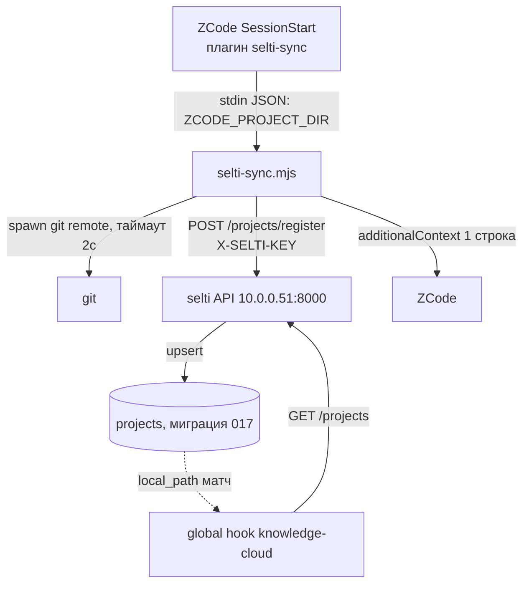

# ADR-018: Автоматическая регистрация проектов — плагин «selti-sync»

**Статус:** proposed
**Автор:** Эна (architect)
**Дата:** 2026-09-19
**Связанные ADR:** — (реестр проектов — миграция 017, часть плана PLAN_MEMORY_REDESIGN.md)

---

## Контекст

- Реестр `projects` (UNIQUE slug, nullable repo_url, машинно-зависимый local_path) существует; CRUD в Фазе 3/5 — далеко. Регистрация ручная (seed миграцией 017), Мастер забывает.
- Глобальный хук `knowledge-cloud.mjs` (Node 18, zero-deps, graceful exit 0) читает `GET /projects`, матчит `ZCODE_PROJECT_DIR` по local_path — зарегистрированные воркспейсы получают облачко знаний автоматически. Плагин закрывает только дыру «проект не зарегистрирован».
- API без аутентификации (известная дыра из аудита), сервер в LAN (10.0.0.51:8000), Windows-хост — другая машина.
- **Ограничение:** без новых таблиц и миграций — используем `projects` из миграции 017 как есть. Решение должно уложиться в «хук-скрипт + один POST-эндпоинт».

## Схема



## Решение A: контракт `POST /projects/register`

Идемпотентный upsert, вся логика разрешения совпадений — **на сервере** (плагин не держит состояния и не решает ничего). Запрос:

```json
{"slug": "albedo", "name": "albedo", "kind": "code",
 "local_path": "E:\\Projects\\Python\\albedo",
 "repo_url": "https://github.com/Dek1m/albedo.git"}
```

- `kind` всегда `"code"` (плагин регистрирует только git-репозитории), `name` = slug, остальное — дефолты таблицы.
- Ответы: **201** `{status:"created", slug, id}`; **200** `{status:"matched"|"path_updated", slug}` — slug занят тем же repo_url (repo_url нормализуем: без `.git` и trailing slash); **409** `{status:"slug_conflict", slug}` — slug занят **другим** repo_url; **401/422** — auth/валидация.

**409, а не суффикс.** Суффикс (`albedo-2`) порождает автогенерированный мусор в реестре и гонку при параллельных стартах сессий. Slug-conflict — редкое событие (клон другой папки под тем же именем); его надо показать человеку, а не прятать. Плагин на 409 молчит — а Мастер при желании увидит в логах.

**Порядок матчинга в плагине не нужен — он делегирован серверу.** Плагин шлёт только POST; сервер внутри обрабатывает: repo_url совпал → matched; local_path совпал у проекта с другим slug → вернуть его slug (path_updated, избегаем дублей одной папки под двумя slug); slug совпал при repo_url IS NULL (случай albedo) → принять как matched и записать repo_url. Это оправдывает NULL-семантику: `repo_url IS NULL` считается «свободным для привязки», а не «неизвестным».

## Решение B: минимальная защита записи — `X-SELTI-KEY`

- Сервер: при старте читает env `SELTI_API_KEY`; если **непустой** — POST `/projects/register` требует заголовок `X-SELTI-KEY` с тем же значением, иначе 401. Если пустой — эндпоинт ведёт себя как сегодня (совместимость, ничего не ломается у существующих клиентов).
- Плагин: ключ из env `SELTI_API_KEY`; GET /projects не трогаем — проверка только на мутирующем эндпоинте.

**Оценка достаточности для LAN:** это «защёлка», не дверь — и этого достаточно сейчас. Она отсекает случайных клиентов (браузеры, сканеры, скрипты), которые не знают ключ, и не даёт плагину случайно записать в чужой сервис. Она не защищает от хоста LAN, который ключ прочитал (ключ лежит в файлах на доверенных машинах — тот же уровень угрозы, что и весь API без auth), и от MITM (plain HTTP). Полноценный auth — часть общего плана безопасности, дублировать его здесь не будем: когда появится общий auth, `X-SELTI-KEY` уходит, и эндпоинт переходит на него одним коммитом.

## Решение C: размещение и дистрибуция

Папка `zcode-plugin-selti-sync/` в корне репо selti, рядом со `scripts/zcode-hook/` — один репозиторий, один источник истины для серверной части и плагина; дистрибуция через сам git (репо уже есть на Windows-хосте), без marketplace-публикации. Установка — локальная (plugin-workspace / локальный marketplace на хосте).

**Почему не workspace-уровень хука:** knowledge-cloud остаётся глобальным (решение Мастера). Плагин наследует то же свойство: он должен работать в *любом* git-воркспейсе (в этом весь смысл автозаписи), поэтому ставится глобально один раз, а не per-project.

**Multi-machine:** local_path уникален на машину — POST `path_updated` должен обновлять local_path только для пары (slug, repo_url), записанной с этой же машины или NULL. Конфликт «две машины, один repo_url, разные local_path» — не решаем на этом уровне (последняя запись выигрывает); это приемлемо, т.к. облачко-матчинг идёт по local_path конкретной машины, и запись актуальна только пока её хост активен. Формат hooks плагина (`hooks/hooks.json`, формат как у Claude Code) — помечаем как требующий проверки по skill-creator / документации ZCode при реализации; если формат иной — меняется только декларация, алгоритм хука не зависит от неё.

## Решение D: алгоритм SessionStart-хука — **только POST, без GET**

stdin JSON → `ZCODE_PROJECT_DIR` → `git remote get-url origin` (spawn git, таймаут 2с; не git или нет origin → **exit 0 молча**) → **POST /projects/register** → по ответу:

- **201** → одна строка additionalContext: `selti: проект «albedo» зарегистрирован (slug albedo)`.
- **200 matched/path_updated, 409, любая ошибка сети** → exit 0, тишина.

**Почему без GET.** Идемпотентный POST *сам и есть* проверка «зарегистрирован ли»: slug+repo_url совпали → сервер отвечает 200 и ничего не пишет (no-op не дёргает updated_at), не совпали → создаёт. Второй GET /projects на старт сессии даёт только копию знания, которое сервер вернёт и так, — минус один сетевой ход, минус вторая логика матчинга (риск расхождения с логикой knowledge-cloud). Один HTTP-запрос на старт сессии — пренебрежимо.

**Известное следствие — race с knowledge-cloud:** если он на этой же сессии прочитает GET *до* нашего POST, облачко для нового проекта придёт только со следующей сессии. Это graceful degradation, фиксировать не будем — соглашение «зарегистрирован → со следующего запуска получаешь облако» предсказуемо и не стоит очереди событий.

## Обоснование (трейдоффы)

| Выбор | Что даёт | Чем платим |
|---|---|---|
| POST-only без GET | 1 запрос на старт, одна логика матчинга (сервер) | Облачко новому проекту — со следующей сессии |
| 409 на slug_conflict | Никакого автогенерированного мусора | Редкий случай требует ручного внимания |
| X-SELTI-KEY | Отсекает случайную запись в LAN | Не защита от знающего ключ; уйдёт с общим auth |
| Плагин в репо selti | Единый источник, версионирование вместе с API | Установка руками на каждом хосте |
| kind всегда "code" | Не расширяем схему, нет миграций | infra/domain-проекты — руками |

## Последствия

- +1 роут `POST /projects/register` (~40 строк: pydantic-модель, нормализация repo_url, SELECT-по-ключам → INSERT/UPDATE), +1 файл хука (~80 строк, стиль knowledge-cloud: zero-deps, graceful exit 0), +1 манифест плагина.
- Реестр пополняется автоматически только git-проектами с remote origin — не-git папки и клоны без origin не замусоривают таблицу.
- При появлении общего auth (аудит) эндпоинт переключается на него; при Фазе 3/5 (CRUD веб) эндпоинт остаётся как машинный канал, CRUD — человеческий.

## Делегирование

- **Сона:** эндпоинт `POST /projects/register` в `memory_server/api/` (по образцу `context.py`), проверка `X-SELTI-KEY`, хук `selti-sync.mjs` + манифест плагина (формат hooks — сверить с skill-creator), тесты.
- **Катерина:** приёмка: идемпотентность (повторный POST = no-op без сдвига updated_at), все ветки ответов 201/200/409/401/422, гонка двух параллельных POST с одним slug, не-git папка → тишина, поведение при пустом/заданном SELTI_API_KEY.
