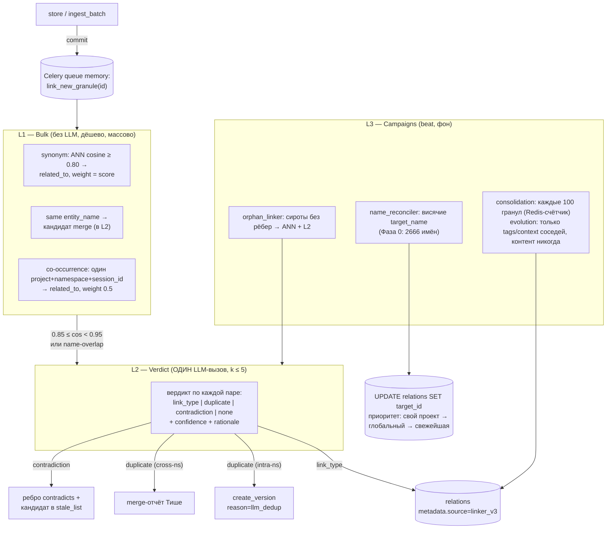

# ADR-019: Memory v3 — полная история версий гранул и автолинкер «Линкер V3»

**Статус:** proposed
**Автор:** Эна (architect)
**Дата:** 2026-09-20
**Связанные ADR:** ADR-017 «GRAPH_LINKS_V2_ARCHITECTURE.md» (пайплайн L1–L4, пороги, формула confidence — наследуется и расширяется), план PLAN_MEMORY_REDESIGN.md (Фазы 0–2 задеплоены)

---

## Контекст

Директива Мастера: «Память не проблема. Избегайте односложных и суперпростых решений. Пусть решение будет элегантным, красивым, быстрым и в общем крутым». Требования: (1) полная история по грануле сохраняется всегда; (2) ссылка новая↔старая есть; (3) Тишь не ставит линки вручную вообще; (4) версия наследует связи графа; (5) вектор старой остаётся; (6) diff для версий; (7) elegance over simplicity.

Текущее состояние (верифицировано по коду, HEAD после Фазы 2):

- Версионирование Фазы 2 деплойнуто: `supersedes`/`superseded_by` (миграция 018), `create_version` = INSERT-SELECT + атомарное закрытие старой по правилу Graphiti `valid_to = new.valid_from` (`queries.py` SUPERSEDE_MEMORY), `GET_HISTORY` — рекурсивный CTE в обе стороны. **Двусторонняя связь версий подтверждена — используем.**
- **Дыра 1:** связи не наследуются — `pg_repository.create_version` (334–381) не трогает relations; на проде 10 из 12 superseded сидят на рёбрах, наследники — узлы-сироты.
- **Дыра 2:** `cluster_id` не наследуется (INSERT_MEMORY_VERSION не выбирает его).
- **Дыра 3:** `memory_update(content=…)` правит на месте безвозвратно (UPDATE_MEMORY COALESCE, вектор перезаписывается); docstring тулов рекомендует этот путь; 13 правок на месте против 12 supersede, 0 цепочек длиннее 2 — версионирование фактически не используется.
- **Дыра 4:** `graph_traverse_full` (миграция 021) не фильтрует статус узлов — мёртвые версии в выдаче.
- **Дыра 5:** `SELECT_MEMORY_BY_ENTITY_NAME` (queries.py:74–80) — `LIMIT 1` без `ORDER BY` и фильтра статуса: недетерминизм, ребро может прилипнуть к трупу.
- **Дыра 6:** 46.6% рёбер (11782/25299) — висячие `target_name`; резолвится только UUID (SYNC_LINKS_BATCH regex); 2666 имён резолвимы прямо сейчас. ADR-017 не реализован.
- **Дыра 7 (мина):** GC purge удалит трупы → FK CASCADE снесёт исходящие рёбра, SET NULL оставит висяки (005). GC сейчас dry_run, боевой через месяц.
- Вектор старой версии в Qdrant остаётся (payload `status=superseded`), поиск обоими каналами фильтрует корректно; `include_historical=True` — time-travel.
- Provenance: Тишь уже пишет `metadata.session_id` / `message_ids` / `links` — готовая опора для происхождения версий.
- Celery beat уже крутит: rebuild_contexts, refresh_clusters (ANN-паттерн по Qdrant прод-обкатан на 14.7k точек), confidence_decay, mark_stale, gc_superseded, orphans_cleanup.

Ресёрч Луны (первоисточники) — строим на: Graphiti/Zep (bitemporal-правило закрытия окна, один LLM-вызов на дубликат+противоречие+тип, cheap same-endpoints фильтр кандидатов), A-MEM (kNN k=5 → один LLM-вердикт; evolution трогает только tags/context соседей; консолидация пачкой каждые 100 заметок; урок — резолвить реальные UUID), HippoRAG 2 (synonym-рёбра по embedding ≥0.8 БЕЗ LLM; LLM только фильтр топ-5), Mem0 v3 (bulk co-occurrence без типов — урок против переусложнения bulk-слоя), Neo4j versioning (якорь + LATEST; рёбра на якорь), Wikidata (ranks preferred/deprecated), XTDB (indirection — связи по id сущности).

Ограничения: PostgreSQL/Qdrant/Celery остаются; никаких новых движков (берём идеи Graphiti/Neo4j, не серверы); обратная совместимость MCP-тулов; 656 тестов не сломать; код на английском, комменты на русском.

---

## Решение A. Модель истории: append-only цепочка в `memories` (остаёмся), + entity-timeline одним запросом

**Решение.** Версии остаются строками `memories` с supersedes-цепочкой. Никакой отдельной таблицы `memory_versions`. Добавляются три вещи:

1. **`GET_ENTITY_TIMELINE`** — SQL-контракт (не материализованный view): полная история сущности = рекурсивная цепочка от любой версии ∪ все строки с тем же `metadata->>'entity_name'` (включая соседние цепочки после merge/fork), сортировка по `valid_from`. Один запрос, один round-trip. Entity_name живёт в JSONB — вытянутый expression-индекс `idx_memories_entity_name` (018) уже обслуживает вторую половину UNION.
2. **Bitemporal-дисциплина Graphiti подтверждается как единственный путь закрытия:** `valid_to(старой) = valid_from(новой)`, не `now()` — уже реализовано в SUPERSEDE_MEMORY; всё, что закрывает гранулу (merge, retract, supersede), идёт через этот инвариант. Никакого второго времени (`expired_at` vs `invalid_at`) не заводим: у нас один источник истинности — появление наследника; система узнаёт о falsehood в момент INSERT наследника, расхождение двух времён возникает только при асинхронном инжесте одинаковых фактов, чего exact-dedup не пропускает.
3. **Provenance версии:** `create_version` добавляет в metadata новой строки `supersede_reason` (аргумент тула), `supersedes_id`, и сохраняет `session_id`/`message_ids` источника (наследуются dict-merge'ом из старой). Цепочка версий + session_id = трасса «от факта к диалогу» без новой таблицы (паттерн Graphiti episodes, дешёвая версия).

**Трейдоффы:**

| Вариант | Что даёт | Чем платим | Вердикт |
|---|---|---|---|
| Append-only в `memories` (текущее) | Нулевая миграция контракта; partial-индексы и фильтры статуса уже в каждом запросе; GET_HISTORY работает | Таблица растёт (память — не проблема по директиве); «мусорные» строки в одном физическом пространстве с живыми | **Принято** |
| Отдельная `memory_versions` | Чистая «горячая» таблица | Дублирование схемы; JOIN на каждом чтении; миграция всех 30+ SQL-констант и 656 тестов; два места истины статуса | Отклонено |
| PG `tstzrange` + EXCLUDE-констрейнт | БД гарантирует непересечение окон | Требует выделенной entity-колонки с уникальностью (entity_name не уникален); PK/UNIQUE придётся расширять временными колонками | Отклонено: непрерывность окон уже структурно гарантируется атомарным SUPERSEDE_MEMORY (FK + один UPDATE) |

---

## Решение B. Наследование рёбер: гибрид — материальный перенос в транзакции supersede + time-travel проекция в traverse

**Решение.** Гибрид из трёх движений:

1. **Перенос рёбер атомарно с созданием версии.** В ту же транзакцию `create_version` (и в миграционный backfill) добавляются два батч-UPDATE:

```sql
-- REWIRE_RELATIONS_ON_SUPERSEDE: рёбра переезжают на наследника
UPDATE relations SET target_id = $2,                      -- new_id
                      metadata = metadata || jsonb_build_object('inherited_from', $1::text)
WHERE target_id = $1                                     -- old_id
  AND link_type <> 'supersedes';                         -- системные рёбра версий не трогаем

UPDATE relations SET source_id = $2,
                      metadata = metadata || jsonb_build_object('inherited_from', $1::text)
WHERE source_id = $1
  AND link_type <> 'supersedes';
```

   Индексы `idx_relations_source`/`idx_relations_target` (005) уже есть — перенос O(степень узла), у гранулы обычно <10 рёбер. Метка `inherited_from` сохраняет историю происхождения ребра (от какой версии унаследовано) без второй таблицы рёбер.

2. **`cluster_id` наследуется** — колонка добавляется в SELECT INSERT_MEMORY_VERSION (дыра 2 закрывается одной строкой SQL).

3. **Time-travel графа.** `graph_traverse_full` v3 (миграция 023) получает параметр `p_as_of TIMESTAMPTZ DEFAULT NULL`:
   - `p_as_of IS NULL` (дефолт, все текущие клиенты): узлы фильтруются `status='asserted' AND valid_to IS NULL` — дыра 4 закрыта, traverse показывает **эффективный граф текущих версий**;
   - `p_as_of` задан: узлы — `valid_from <= p_as_of AND (valid_to IS NULL OR valid_to > p_as_of)`, рёбра — `created_at <= p_as_of` (рёбра, перенесённые на наследника после `p_as_of`, в историческом графе остаются на старом `inherited_from`-узле — восстанавливается проекцией: `CASE WHEN r.created_at > p_as_of AND r.metadata->>'inherited_from' IS NOT NULL THEN (r.metadata->>'inherited_from')::uuid ELSE r.target_id END`).

   Исторический граф по точке времени получается **без хранения второго графа**: окна версий уже в строках, происхождение рёбер — в `inherited_from`.

**Трейдоффы:**

| Вариант | Что даёт | Чем платим | Вердикт |
|---|---|---|---|
| (a) перенос рёбер при supersede | Эффективный граф = физический граф; чтение без изменений | История рёбер требует `inherited_from`-проекции | **Принято как компонент** |
| (b) якорь-сущность + LATEST (Neo4j-паттерн), рёбра на якоре | Рёбра не трогаются при версиях вообще | Новая таблица якорей + миграция 15k гранул и 25k рёбер; все пути записи/чтения; entity_name не уникален — якорь надо резолвить (та же дыра 5, но в worse-месте); LATEST-указатель = второе состояние с рассинхронами | Отклонено: слишком дорогая перестройка ради выгоды, которую даёт транзакционный перенос |
| (c) рёбра остаются на трупах + HEAD-резолв на лету при чтении | Идеальная история рёбер даром | Каждый get_relations/traverse платит рекурсивный JOIN HEAD-резолва; traverse по трупам раздувается (дыра 4 наоборот усиливается) | Отклонено: read-path — священен |
| **Гибрид (a + проекция time-travel)** | Чтение быстрое всегда; история восстановима; миграция — два UPDATE + один SELECT-столбец | Правило «переносить всё, кроме системных рёбер» | **Принято** |

---

## Решение C. Автолинкер «Линкер V3»: трёхслойная пирамида

Новый модуль `memory_server/memory/linker.py` (ядро) + `memory_server/tasks/linker_tasks.py` (Celery) + `memory_server/llm/provider.py` (LLM-клиент по образцу embedding-провайдера — тот же класс внешнего API, не новый сервис).

### Пирамида



### Слои и пороги (обоснование каждого числа)

| Слой | Диапазон cosine | Действие | Источник порога |
|---|---|---|---|
| silence | < 0.80 | ничего | HippoRAG 2: ниже 0.8 synonym-рёбра шумят |
| **L1 synonym** | 0.80 ≤ cos < 0.85 | `related_to`, `weight = score`, metadata `{source: linker_v3, layer: l1}` | HippoRAG 2: тысячи рёбер бесплатно без LLM; weak-typed, но weight честный — UI и ранжирование фильтруют |
| **L2 серая зона** | 0.85 ≤ cos < 0.95 | один LLM-вызов на гранулу (≤5 кандидатов в одном промпте): тип из CNLM-матрицы / duplicate / contradiction / none | Директива (0.85–0.95) + совместимость с порогами автолинкера v1.1 (≥0.85 — конкретный тип, CHANGELOG-auto-linker-cnlm.md); Graphiti: один вызов решает всё |
| **dedup-зона** | cos ≥ 0.95 | НЕ территория линкера — там живёт DedupEngine (`dedup_threshold=0.95`) | Существующий конфиг; слои не перекрываются, конкуренции нет |

Дополнительные кандидаты L2 без cosine: **name-overlap** (same entity_name — merge-сигнал), **co-occurrence** (один `project_id` + namespace + `metadata.session_id` — L1-ребро сразу, weak).

### Операционные свойства

- **Store не дорожает:** после commit — `link_new_granule.delay(id)` в существующую очередь `memory`; p95 store не меняется ( асинхронно, acks_late, retry — весь обкатанный каркас SeltiTask).
- **ANN-слой:** тот же паттерн, что `refresh_clusters` (батчи RETRIEVE_BATCH_SIZE → retrieve векторов → query_batch_points с фильтром namespace+asserted) — прод-обкатан на 14.7k точек, 620-секундной деградации триграмм нет и не будет.
- **Идемпотентность:** verdict-cache в Redis, ключ `(a_id, b_id, hash(a_content), hash(b_content))`, TTL 30 дней — при неизменных контентах повторный прогон не платит LLM (урок ADR-017 A.3); INSERT_RELATION ON CONFLICT-тройка уже ловит дублі рёбер.
- **Владение:** автосвязи пишутся прямо в `relations` с `metadata.source="linker_v3", campaign_id` — НЕ через `metadata.links` (источник истины Тиши) и НЕ с `synced_from` (его сотрёт следующий sync). Третий владелец наряду с Тишью и ручными — механизм уже в схеме.
- **LLM-отказ:** L2 пропускается с warning, кандидаты не теряются — сирот подберёт L3-orphan_linker; Qdrant-отказ → VectorStoreError → Celery retry. Деградация, не падение.
- **Консервативность A-MEM:** evolution-кампания обновляет ТОЛЬКО `metadata.tags`/`metadata.context` соседей — контент никогда (их баг с позиционными индексами закрыт резолвом реальных UUID, не индексов).
- **Счётчик консолидации:** Redis `INCR linker:granules_since_consolidation`, при 100 — задача кампании, счётчик сбрасывается (пайплайн, а не IF-ветка в store).

---

## Решение D. Ветвление: preferred-наследник в колонках, ветки — рёбрами, merge — первоклассная операция

**Модель:** дерево версий. Правила:

1. **Линейная цепочка (99% случаев):** `superseded_by` — единственный наследник, как сейчас. GET_HISTORY уже обходит дерево (UNION обе стороны, `min(dist)`) — форк не ломает чтение истории.
2. **Fork из середины:** `create_version` от не-HEAD версии разрешён только с явным `branch`-лейблом (в metadata). Второй наследник не перезаписывает `superseded_by` (guard в SUPERSEDE_MEMORY: обновлять только если IS NULL или совпадает), а получает ребро `link_type='supersedes'` от родителя + `metadata.branch`. HEAD-резолв цепочки: `superseded_by`-колонка = **preferred** (ранг Wikidata preferred); ветки видимы через рёбра.
3. **Инвариант «один asserted на (entity_name, project_id)»:** не constraint (entity_name в JSONB, проект может быть NULL), а инвариант-кампания в L3-consolidation: две asserted-грани с одним именем → отчёт Тише на merge. Fork с конкурирующим утверждением оформляется честно: старая ветка закрывается `status='uncertain'` (статус уже в CHECK 018 — впервые находим ему работу).
4. **`memory_merge(source_id, target_id)`:** новая гранула (контент — результат слияния/правки вызывающим), обе исходные закрываются superseded с `supersede_reason='merge'`, `superseded_by` обеих → новая (два указателя на одного наследника допустимы: колонка не UNIQUE, HEAD-резолв сходится), рёбра обеих переносятся REWIRE-ом с dedup по `(endpoint, link_type)` (winning weight = max), `cluster_id` наследуется от крупнейшей стороны. Entity timeline (решение A) после merge показывает обе цепочки одной сущностью.

**Трейдофф:** «только линейная цепочка» проще, но Мастер явно требовал ветвление, а merge двух имён — единственный честный способ убрать 46.6% висячих `target_name` навсегда. Цена — guard в одном UPDATE и инвариант-кампания: приемлемо.

---

## Решение E. Контракт записи: `content` физически неизменяем, повтор факта = подтверждение

**Контракт:**

1. **`memory_update(content=…)` внутренне = `create_version(reason='edit')`.** Тул сохраняет сигнатуру; ответ — новая версия с полями `id` (новый), `supersedes` (старый id). Клиенты, держащие старый id, получают его валидную историю через `memory_get_history` — обратная совместимость семантическая, не идентификаторная (id версии и есть её адрес — это правильно).
2. **SQL UPDATE_MEMORY теряет ветку `content`.** После переходного фича-флага `update_content_deprecated` (true → 400 с подсказкой «используйте memory_supersede») колонка `content`/`content_hash` удаляется из UPDATE: **Тишь физически не может потерять историю** — не «не должна», а «не может», путь уничтожения отсутствует в слое данных. Триггер version-bump остаётся (он только на content — и content больше не меняется UPDATE'ом; version растёт исключительно INSERT'ами версий, что честнее).
3. **Dedup-путь `UPDATE` (user_facts, exact-hash) превращается в confirm-семантику:** повторный store байт-идентичного факта = подтверждение: metadata merge + `bump_access` + `confidence' = c + (1 − c) × 0.1` (каждое точное повторение приближает уверенность к 1, никогда не перескакивая — Bayesian-стабилизация в духе `n/(n+1)` A-MEM, но без счётчика). Контент не менялся (hash совпал) — истории нечего терять, терялся только аудит: теперь повтор видим в `access_count` и confidence.
4. **SKIP-путь dedup:** тот же confirm + `sync_links_to_relations` (закрывает Г3 из ADR-017 — сейчас links при SKIP не синкаются вовсе).
5. `metadata`/`importance`/`frozen`/`project_id` остаются правкой на месте — это обвязка факта, не факт.
6. Docstring'и `memory_update`/`memory_supersede` меняются местами по смыслу: supersede — единственный путь изменения факта, update — обвязка.

**Отклонено:** draft→commit (Letta) — второй жизненный цикл ради той же гарантии, которую даёт immutable-content + append-only; рестор-операции не нужны (никогда не удаляли).

---

## Решение F. GC: полная история = purge по умолчанию выключен, стоп-кран в конфиге

- `gc_mode: "dry-run" | "disabled" | "retracted-explicit"` — **новый дефолт `disabled` для superseded**: `SELECT_GC_SUPERSEDED` с пустым результатом до явного решения Мастера. Директива «полная история сохраняется всегда» = superseded-цепочки не удаляются вообще.
- Явно разрешённый (будущий, отдельным решением Мастера) режим `retracted-explicit`: только `status='retracted'` старше N месяцев, вызванный вручную, не по расписанию.
- **Стоп-кран:** `gc_purge_enabled: bool = False` —_master-выключатель выше любых режимов; недельный beat-задача продолжает отчитывать счётчики кандидатов (наблюдаемость без действия).
- Мина FK (дыра 7) обезвреживается дважды: (1) purge выключен; (2) даже при будущем включении — после решения B у трупов не остаётся перенесённых рёбер, REWIRE уже увёл ссылки на наследника; DELETE_GC_DANGLING_RELATIONS остаётся страховкой.
- Qdrant-точки трупов не удаляются никогда (time-travel); объём — не проблема по директиве.

---

## Решение G. API / MCP-тулы

| Тул | Статус | Контракт |
|---|---|---|
| `memory_update` | меняется семантика | content → создаёт версию (E.1); сигнатура та же; ответ + `supersedes` |
| `memory_supersede` | расширяется | + `reason: str \| None` (provenance), + `branch: str \| None` (D.2) |
| `memory_get_history` | расширяется | + `mode: "chain" \| "entity"` (entity — timeline по entity_name, решение A), + `include_diffs: bool = False` — unified diff соседних версий, рендер `difflib` на лету (вариант Соны принят) |
| `memory_diff` | **новый** | `(granule_a, granule_b)` → content unified diff + diff ключей metadata; работает для любых двух версий, не только соседних |
| `memory_linker_stats` | **новый** | счётчики по слоям/вердиктам, pending сироты/имена, последние кампании, verdict-cache hit-rate |
| `memory_merge` | **новый** | `(source_id, target_id, content, …)` — операция D.4 |
| `memory_link` / `memory_unlink` / остальные | не меняются | — |

Совместимость: сигнатуры существующих тулов неизменны; `include_historical` в `/api/search` уже есть; GranulePanel веб-морды получит diff-виджет опционально (отдельная задача Ирис, вне этого ADR). Ручной `memory_link` остаётся для человека; политика Тиши — не пользоваться им (директива (3)), линкер закрывает её потребность.

---

## Решение H. Миграция 023 (+ поведение кода без миграций)

`migrations/023_memory_v3_versions_linker.sql` (Нора):

1. **Индекс** `idx_memories_superseded_by ON memories (superseded_by) WHERE superseded_by IS NOT NULL` — HEAD-резолв и backfill.
2. **`graph_traverse_full` v3:** сигнатура `(UUID, INT, TEXT[], TIMESTAMPTZ DEFAULT NULL)`; дефолт — фильтр актуальности узлов (дыра 4); `p_as_of` — исторический граф с `inherited_from`-проекцией (решение B.3). LANGUAGE sql — тело парсится при CREATE.
3. **Backfill A — наследование задним числом для 12 существующих superseded:** DO-блок: для каждой superseded с наследником — REWIRE-перенос рёбер + `UPDATE memories SET cluster_id = (SELECT cluster_id FROM …)` наследнику; отчёт в `_migrate_report`-стиле (сколько рёбер переехало).
4. **Backfill B — кампания резолва 2666 имён (Фаза 0 Линкера):** батчевый lateral-UPDATE из решения ADR-017 A.1 (приоритет: свой проект → глобальный → свежейшая asserted), батчи по 500, отчёт нерезолвленных имён в `_migrate_report`.
5. В `SELECT_MEMORY_BY_ENTITY_NAME` добавляется детерминированный `ORDER BY (status='asserted' AND valid_to IS NULL) DESC, created_at DESC` — **фикс в queries.py** (V3.0), не в миграции.

Не в миграции: anti-inverse guard и владелец-метки — знание приложения, не БД (обоснование ADR-017 A.2 сохраняется); `branch`/`reason` — metadata, без DDL.

---

## Решение I. Фазирование (каждая фаза независимо принимается Катериной и деплоится без остановки)

| Фаза | Состав | Файлы / объём | Приёмка |
|---|---|---|---|
| **V3.0 — Честный контракт записи** (1–1.5 д) | фикc SELECT_MEMORY_BY_ENTITY_NAME; E.1+E.2 (флаг `update_content_deprecated`); confirm-семантика dedup UPDATE/SKIP + sync на SKIP; докстринги тулов | queries.py, service.py, dedup.py, tools/memory_tools.py, config.py; ~150 строк + ~150 тестов | Катерина: обновлённые контракты, история не теряется ни одним путём записи |
| **V3.1 — Наследование графа** (2–3 д) | миграция 023 (индекс, traverse v3, backfill A); REWIRE + cluster_id в create_version транзакции; `reason`/`branch` в supersede; GC-режимы + стоп-кран (F) | migrations/023, queries.py, pg_repository.py, repository.py, service.py, config.py, lifecycle_tasks.py; ~350 строк + ~200 тестов | Катерина: supersede переносит рёбра/кластер атомарно; traverse без трупов; time-travel по as_of |
| **V3.2 — Линкер фаза 0 + L1a** (2–3 д) | резолв имён: lateral-JOIN в SYNC_LINKS_BATCH/BACKFILL + резолв-на-лету при store (по entity_name) + name_reconciler beat; миграционный backfill B (2666 имён); co-occurrence L1c | queries.py, pg_repository.py, service.py, tasks/linker_tasks.py (новый), celery_app.py; ~300 строк + ~150 тестов | Катерина: висячие target_name ≤ нерезолвимых; store p95 не изменился |
| **V3.3 — L1b + L2 Verdict** (3–4 д) | ANN synonym-слой (0.80–0.85 related_to); LLM-провайдер; один-вызов-вердикт (тип/duplicate/contradiction/none); verdict-cache; duplicate→create_version; contradicts→stale_list; метрики + `memory_linker_stats` | memory/linker.py (новый), llm/provider.py (новый), tasks/linker_tasks.py, tools/, metrics.py; ~500 строк + ~200 тестов | Катерина: вердикты на golden-сетке пар; отказ LLM/Qdrant = деградация |
| **V3.4 — L3 + diff + merge + timeline** (2–3 д) | orphan_linker; consolidation (счётчик 100, evolution metadata-only); `memory_diff`; `mode="entity"` + `include_diffs` в get_history; `memory_merge`; инвариант-кампания одного asserted на имя | linker.py, service.py, tools/, tasks/; ~350 строк + ~150 тестов | Катерина: сценарии merge/fork; end-to-end «сущность живёт 5 версий, граф непрерывен» |

Итого: ~1650 строк продукта, ~850 строк тестов, 1 миграция, 3 новых файла, 656 существующих тестов не ломаются (все изменения контрактов — за фича-флагами или аддитивны).

---

## Нефункциональные требования

- **Производительность:** store p95 без изменений (линк асинхронен); REWIRE — O(степень узла) в той же транзакции; L1 — батчевый ANN по образцу refresh_clusters; L2 — ≤1 LLM-вызов на гранулу при ≤5 кандидатах в одном промпте (5× экономия против попарных вызовов); verdict-cache гасит повторы.
- **Масштабируемость:** append-only растёт линейно по числу версий (память — не проблема); чтение не деградирует: partial-индексы статуса уже отсекают трупы; ANN-слой O(N·K) на батч новых гранул, не на корпус.
- **Отказоустойчивость:** отказ LLM → пропуск L2 (L3 догонит сирот); отказ Qdrant → retry Celery; REWIRE атомарен с INSERT версии — рассинхрона «версия есть, рёбра не переехали» не существует; GC выключен по умолчанию — мина FK обезврежена.
- **Безопасность:** LLM-ключ — env, тот же паттерн, что эмбеддинги; в LLM-промпт уходит контент гранул — та же граница доверия, что у embedding-провайдера (уже принятая); ключи/секреты не в коде.

## Риски

1. **Шум L1 (0.80–0.85 related_to без LLM)** — смягчение: weight=score (UI-фильтр), consolidation-кампания ретрачит слабейшие, слой помечен `layer: l1` — можно выключить флагом без миграции.
2. **Фантомный резолв 2666 имён** (одно имя — много гранул) — приоритет свой-проект→глобальный→свежейшая + отчёт нерезолвленных в `_migrate_report` для ручного разбора Тишью.
3. **Две asserted одного entity_name после fork** — инвариант-кампания (D.3), не constraint; fork требует branch-лейбла.
4. **Смена семантики memory_update(content)** — переходный флаг `update_content_deprecated` с 400+подсказкой; ответ тула содержит `supersedes` — клиенты мигрируют штатно.
5. **LLM-вердикт ошибочен** — verdict-cache хранит rationale (аудит), кампании идемпотентны и переигрываемы, duplicate-вердикт внутри namespace проходит через ConflictError-гарды create_version.

## Связь с ADR-017

ADR-019 поглощает незареализованный ADR-017: пайплайн L1–L4 становится слоями Линкера V3 (L1 sync+резолв → V3.2; L3 инварианты → linker-код; L4 OrphanLinker → V3.4; пороги 0.90/0.85/0.80 → пересобраны в непересекающиеся зоны с dedup_threshold=0.95; формула link-confidence A.4 → вес рёбер линкера). Статус ADR-017 после принятия ADR-019 — superseded.
