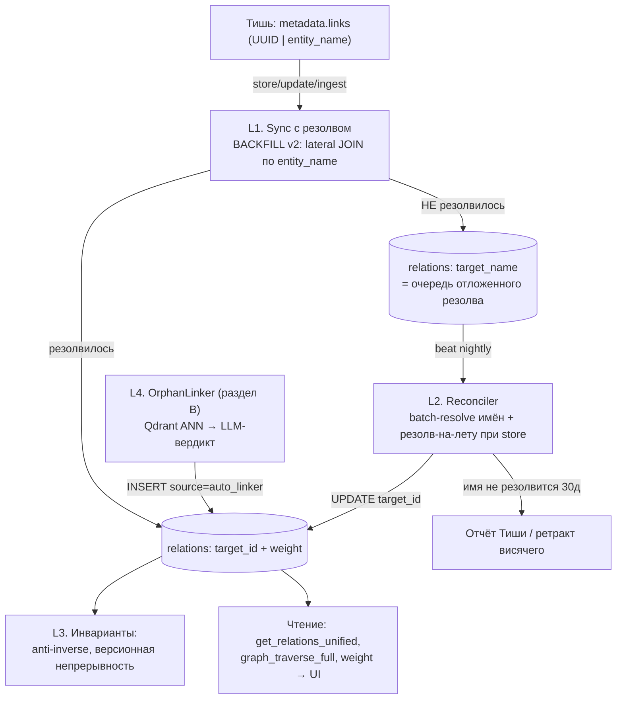

# GRAPH_LINKS_V2 — Архитектура постановки связей и связывания сирот

> Автор: Эна (architect), 2026-09-19. Исследование по директиве Мастера
> «найти более правильную постановку связей, не взирая на сложность формул».
> Базис: коммит 658f822. Код не менялся — это дизайн-док фазы F плана
> PLAN_WEB_UI_PHASE2.md. Вердикты «ломать/чинить/оставить» — на декларацию Мастера.

## Архитектура: Постановка связей и связывание сирот в графе знаний selti

**Тип:** эволюция существующего пайплайна (additive, без ломки контрактов)
**Стандарт:** docs/CODING_STANDARD.md, преемственность PLAN_MEMORY_REDESIGN (Фазы 0-2)

---

## 0. Диагноз: почему граф серый (факты по коду)

**Механика сегодня.** Связи рождаются двумя путями:

1. **Ручной** `memory_link` → `service.add_relation` (service.py:1028) → `_resolve_granule` (service.py:1000) — резолвит **и UUID, и entity_name** через `SELECT_MEMORY_BY_ENTITY_NAME` (queries.py:74, expression-index `idx_memories_entity_name`, 018b:53). Этот путь работает правильно.
2. **Массовый** `metadata.links` при store/update/ingest → `sync_links_to_relations` (pg_repository.py:552) / `sync_links_batch` (pg_repository.py:558, memory_tasks.py:729). Резолв цели — **только UUID-regex** (queries.py:601, :647): не-UUID падает в `target_name` как висячая связь по имени и **никогда не резолвится** — reconciler-задачи не существует.

**Три подтверждённых генератора серости:**

- **Г1. Нет резолва имён в синке.** Тишь вынуждена писать entity_name для forward-ссылок (UUID будущих гранул она знать не может — они генерятся сервером). Профиль Тиши (memory-granulator.md:230) разрешает оба варианта, не требуя UUID. Выборка живых гранул показывает ~40-50% links с entity_name-целями (например, гранула Фазы 2: из 4 links два — entity_name `selti-phase2-supersession-api-details`, `selti-phase2-beat-migration-details`). Это **не ошибка Тиши — это архитектурная недоработка сервера**: система принимает имена, но не резолвит их.
- **Г2. Тайминг батчей.** `ingest_batch` синкает links сразу после вставки батча (memory_tasks.py:726-731), а документ гранулируется 20-30 вызовами по ≤20 гранул. Цель по entity_name из *следующего* батча на момент синка не существует — даже с резолвом имён связь осталась бы висячей. До-синка нет.
- **Г3. Dedup-пути store без синка.** При `DedupAction.UPDATE` metadata (включая links) мержится (service.py:178), но `sync_links_to_relations` **не вызывается** — только в основном insert-пути (service.py:202-207). При `SKIP` — ранний return, links не синкаются вовсе.

**Что уже хорошо и не трогаем:** partial unique `(source_id, target_id, link_type) WHERE target_id IS NOT NULL` (005:69) + unique висячих `(source_id, target_name, link_type) WHERE target_id IS NULL` с дедупом (018:280-311); пометка владения `metadata.synced_from` (ручные связи синк не трогает, queries.py:633); CHECK на 32 канонических типа (018:174); `target_name`-индекс как готовая очередь резолва (005:60); graceful-паттерны VectorStoreError/SchemaPendingError из refresh_clusters (service.py:693-704).

---

## A. Правильная постановка связей: четырёхуровневый пайплайн

### Схема



### A.1 Двухфазный резолвинг target (закрывает Г1, Г2)

**Фаза 1 — резолв в момент синка.** BACKFILL_RELATIONS_FROM_METADATA и SYNC_LINKS_BATCH (queries.py:593, :639) расширяются lateral-резолвом:

```sql
-- в source_links CTE добавить:
LEFT JOIN LATERAL (
    SELECT m2.id AS resolved_id
    FROM memories m2
    WHERE m2.metadata->>'entity_name' = sl.target_str
      AND m2.status = 'asserted' AND m2.valid_to IS NULL
      AND (m.project_id IS NOT DISTINCT FROM m2.project_id   -- 1) свой проект
           OR m2.project_id IS NULL)                          -- 2) глобальный слой
    ORDER BY m2.project_id IS NULL, m2.created_at DESC         -- 3) свежейшая
    LIMIT 1
) res ON true
-- target_id = COALESCE(uuid_target, res.resolved_id)
```

**Почему такой приоритет:** entity_name формально не уникален в БД (уникальность — лишь клиентская конвенция Тиши по `(entity_name, project_id)`). Детерминированный порядок «свой проект → глобальный → свежейшая» исключает недетерминизм `LIMIT 1` без ORDER BY, который сейчас есть в `SELECT_MEMORY_BY_ENTITY_NAME` (queries.py:78) — его тоже надо дополнить этим ORDER BY. Intra-batch резолв работает автоматически: insert батча идёт до sync.

**Фаза 2 — reconciler для отложенных.** Неразрешённое имя остаётся в `target_name` — **новая таблица очереди не нужна**: тройка (source_id, target_name, link_type) уже уникальна (018:309), а `idx_relations_target_name` (005:60) — готовый индекс сканирования. Reconciler — beat-задача nightly в lifecycle_tasks (по образцу `refresh_clusters`, :179):

- `SELECT DISTINCT target_name FROM relations WHERE target_id IS NULL AND target_name IS NOT NULL` → батчевый резолв тем же приоритетом → один `UPDATE relations SET target_id = ...` по пачке имён.
- **Резолв-на-лету (быстрый путь):** в `service.store` после insert, если у гранулы есть `entity_name`, — один дешёвый индексный `UPDATE relations SET target_id = $1 WHERE target_name = $2` (закрывает Г2 в пределах минуты без ожидания beat). Счётчик попыток и `last_attempt_at` — в `relations.metadata` (jsonb уже есть, миграция не нужна).
- **Aging:** имя не резолвится > 30 дней / > 5 попыток → связь не удаляется молча, а попадает в отчёт для Тиши (пере-линк или ретракт висячего). Известный кейс fan-in «1518 гранул → `cpp-docs-downloaded`» (комментарий 018:282) — именно сюда: имя никогда не родится, ручное решение.

**Фаза 2b — закрыть Г3:** в dedup-UPDATE путь store (service.py:166-183) добавить вызов `sync_links_to_relations` — одна строка после `repository.update`. Для SKIP — reconcile links существующей гранулы (мержить metadata не нужно — достаточно sync).

**Трейдофф «новая таблица очереди» vs «target_name как очередь»:** очередь-таблица даёт счётчики/приоритеты явно, но дублирует состояние, требуя синхронизации двух хранилищ. Вариант «target_name = очередь» бесплатно идемпотентен (ON CONFLICT-тройка), уже проиндексирован и виден в UI как висячая связь. Выбираю второй; отдельная таблица — только если очередь вырастет в полноценный workflow с ручным разбором.

### A.2 Инварианты графа

- **Канонические типы:** уже есть (CHECK 018:174) — оставляем. Добавляется **INVERSE-справочник** в коде (не в БД): `depends_on↔used_by`, `calls↔called_by`, `contains↔contained_by`, `informs↔informed_by`, `extends→implements` (нет), `precedes↔follows`, `supersedes→` (односторонняя). 
- **Запрет дублей-синонимов:** unique-тройка (source, target, type) не ловит **инверсный дубль** (`depends_on A→B` + `used_by B→A` — одно ребро дважды). Решение: anti-inverse проверка в синке — перед INSERT `WHERE NOT EXISTS (инверсная пара)`; в reconciliation-кампании (раздел C) — детект и merge с `weight = max(w1, w2)`. Почему на запись, а не constraint: инверсная семантика типов — знание приложения, не БД; constraint по паре направлений потребовал бы триггеров.
- **Взаимность:** обратные рёбра **не материализуем** — чтение уже UNION incoming/outgoing (`get_relations_unified`, 014). Денормализация обратных рёбер = двойной объём + рассинхрон при частичных апдейтах. Отклонено.
- **Транзитивность:** **не материализуем** (A→B, B→C ⇒ A→C): комбинаторный взрыв на 14.7k узлов и ложные связи на транзитивных типах. Обход в глубину уже даёт рантайм-транзитивность (`graph_traverse_full`, миграция 009; CTE-вариант queries.py:491 c защитой от циклов path-массивом).
- **Версионная непрерывность (дыра, которую надо закрыть):** `create_version/supersede` (Фаза 2) **не переносит связи** — при закрытии версии гранулы её рёбра FK SET NULL → целостно дырявят граф, хотя наследник семантически тот же узел. Инвариант: при supersede — `UPDATE relations SET target_id = new_id WHERE target_id = old_id` и то же для source_id (±审议: рёбра `supersedes`-типа не переносим — они про конкретную версию). Это одна из главных причин «серых» узлов в будущем, если не закрыть сейчас.

### A.3 LLM-уровень extraction (candidate generation → вердикт)

Для обогащения связей **не в момент записи**, а кампаниями/фоном:

- **Candidate generation:** Qdrant ANN top-k (см. B) — дёшево, O(N·K), прод-обкатано на 14.7k точек в `refresh_clusters` (repository.py:657-733).
- **LLM-вердикт:** батч пар (две усечённые ~500-токенные выжимки + меню типов + cross-namespace матрица) → структурированный JSON: `{verdict, link_type, confidence, rationale}`.
- **Пороги — переиспользуем обкатанные:** серверный auto-linker (docs/CHANGELOG-auto-linker-cnlm.md, v1.1.0) уже прошёл боль шумных связей и вышел на: **≥0.90 — конкретный тип (высокая), ≥0.85 — конкретный тип, ≥0.80 — `related_to` fallback, <0.80 — связь не ставится**. Заново эти константы не изобретаем.
- **Запись:** прямой INSERT в relations с `metadata = {"source": "auto_linker", "campaign": <id>, "confidence": <c>}`. Критично: **НЕ через metadata.links** — это источник истины Тиши, мутация чужого владельца; и **НЕ с пометкой `synced_from`** — иначе следующий sync её сотрёт (queries.py:633). Механизм владения по metadata-метке уже в схеме — auto_linker просто третий владелец наряду с «тишиными» и «ручными».
- **Идемпотентность:** verdict-cache по `(a_id, b_id, hash(a_content), hash(b_content))` — при неизменных содержаниях повторный прогон не платит LLM. **Dry-run** — фича-флаг + счётный отчёт, прецедент `gc_dry_run` в lifecycle (память: «gc_dry_run=True переключить через месяц»).
- **Стоимость:** см. B (общая оценка там).

### A.4 Уверенность связи (link confidence)

Поле **уже есть** — `relations.weight` (005:16, default 1.0). Переиспользуем его как confidence: API traverse заявляет «взвешенный обход» (005:44), UI фазы D планирует толщину линии = weight (PLAN_WEB_UI_PHASE2.md, фаза D). Никакой миграции.

Скелет формулы (без перегиба — три множителя, всё в [0,1]):

```
confidence = P_source × S_sem × F_status × B_confirm

P_source  — приоритет источника:
            manual memory_link = 1.0; Тишь metadata.links = 0.9;
            auto_linker = вердикт LLM (0.80-0.95 по порогам A.3)
S_sem     — семантическая близость: max(0, (cos − θ) / (1 − θ)),
            θ = порог кандидата ANN (0.85); для manual/Тишь cos можно
            взять лениво из Qdrant при первом конфирме, иначе 1.0
F_status  — свежесть как состояние, не время: обе живы (asserted) = 1.0;
            одна superseded = 0.5; ретракт → связь умирает
B_confirm — байесовская стабилизация повторных подтверждений:
            n/(n+1), n = сколько независимых прогонов подтвердили пару
```

**Почему так:** время (recency_decay из search_fusion.py:116) сюда сознательно **не** тянем — связь не контент, она не «протухает» от неиспользования; старение заменено `F_status` по lifecycle-событиям версий. Отдельного decay-beat для связей нет и не надо.

### Честное сравнение с текущим состоянием

| Что | Вердикт |
|---|---|
| metadata.links как источник истины Тиши + DELETE/INSERT sync | **Оставить** — контракт работает, владение по метке чистое |
| UUID-only резолв в BACKFILL/SYNC | **Ломать** → lateral-резолв имён (A.1) |
| `target_name` как «кладбище» имён | **Переосмыслить** → очередь reconciler-а (A.1) |
| Dedup-UPDATE без sync (service.py:166-183) | **Чинить** — недостающий вызов |
| Supersede без переноса связей | **Чинить** — версионная непрерывность (A.2) |
| Unique-индексы, CHECK типов, пометки владения | **Оставить** (005, 018) |
| Инверсные дубли | **Новый** anti-inverse фильтр + merge-кампания |
| weight = 1.0 всегда | **Оживить** как confidence (A.4) |

---

## B. Алгоритм связывания сирот (OrphanLinker)

Кампания (разовая, ~4.1k гранул) + steady-state beat (nightly, десятки новых сирот/день). Очередь `memory`, паттерн отказоустойчивости — `refresh_clusters` (graceful на SchemaPending/VectorStoreError, service.py:693-704).

**Шаг 0. Выборка сирот с приоритизацией.** Сирота = asserted-гранула вне `UNION(source_id, target_id)` — критерий уже формализован в `graph_stats_unified` (020:238-243). Выборка — anti-join вместо array_agg (020 соберёт весь массив в память; на 15k строк приемлемо, но батчуем сразу):

```sql
SELECT m.id, m.importance, m.access_count, m.created_at
FROM memories m
WHERE m.status='asserted' AND m.valid_to IS NULL
  AND NOT EXISTS (SELECT 1 FROM relations r
                  WHERE r.source_id = m.id OR r.target_id = m.id)
ORDER BY m.importance DESC,
         m.created_at DESC        -- сначала ценные и свежие
LIMIT $batch                      -- 500/прогон
```

Почему `importance DESC, created_at DESC`, а не формула со age: сироты с importance ≥4 — это архитектурные знания, их связывать в первую очередь; старые мелкие (importance ≤2, age > 90д) — кандидаты GC по фазе F.3 плана, гонять на них LLM — тратить деньги впустую. Простая сортировка даёт то же без псевдоточности.

**Шаг 1. Candidate generation — Qdrant ANN.** Дословно паттерн `refresh_clusters` (repository.py:693-733): retrieve векторов сирот пачками 256 → `search_batch(limit=k+1, score_threshold=θ, query_filter=namespace+asserted)`. Параметры: **θ = 0.85** (ниже кластерного 0.92 из config.py:73 — оправдано тем, что дальше LLM перепроверяет; кластеризационный порог строг, ибо решает автоматически), **k = 5**.

**Шаг 2. Фильтры кандидатов (до LLM — экономия):**
- исключить себя (score ≈ 1.0);
- только asserted-цели (Qdrant-фильтр уже есть);
- **cross-namespace матрица CNLM** — кодировать в config как `ALLOWED_CROSS_NS[(src_ns, dst_ns)] -> [link_types]` из профиля Тиши (memory-granulator.md:284-290) и серверного прецедента (CHANGELOG-auto-linker-cnlm.md); пары вне матрицы отсекаются;
- пары, уже имеющие связь (SQL EXISTS) — отсечь;
- **сирота↔сирота разрешены явно** — это ядро запроса Мастера: одна подтверждённая связь выводит из сиротства обе гранулы сразу.

**Шаг 3. LLM-подтверждение.** Батч = 10 сирот × ≤5 кандидатов = ≤50 пар за вызов. Промпт: критерий связи + меню 32 типов + CNLM-матрица (та же, что у Тиши — единая онтология). Выход — JSON-вердикты. Пороги A.3 (0.90/0.85/0.80). **Кап: ≤2 связи на сироту за прогон** — не строим звезду вокруг одной гранулы.

**Шаг 4. Запись.** Прямой INSERT, `metadata={"source":"auto_linker","campaign":id,"confidence":c}`, `weight = confidence` (A.4). Не через metadata.links — обоснование в A.3.

**Шаг 5. Идемпотентность повторных прогонов.** Три механизма:
- связанная гранула автоматически выпадает из выборки шага 0 (сиротство — саморегулирующийся критерий);
- LLM-вердикты кешируются по хешу пары (A.3) — «no_link» тоже кешируется;
- маркер «прогонял, ничего не нашёл»: Redis-ключ `orphan_skip:{id}:{hash8(content)}` с TTL 7 дней — при изменении содержания гранулы ключ меняется сам, повторная обработка легитимна.

**Оценка объёма LLM (кампания 4.1k):** ANN-фаза — то же, что refresh_clusters на полном корпусе (минуты, без LLM). LLM: 4.1k/10 = **~410 вызовов** при батче 10 сирот; вход ≈ 4.1k × 6 фрагментов × 500 токенов ≈ **12M input токенов** единовременно, wall-clock — часы с rate-limit. Steady-state: десятки вызовов/день. Это дешевле, чем кажется, и ровно то, что план фазы F.2 уже наметил как «ре-линк кампания (Тишь)» — OrphanLinker её автоматизирует, оставив Тиши только разбор неразрешимых имён из A.1.

**Альтернатива без LLM (отклонена как основная):** связать сироту с центроидом её кластера (`related_to`, weight=coherence) по итогам refresh_clusters — бесплатно, но плодит шумные `related_to`, и именно от этого серверный auto-linker ушёл, поднимая пороги (CHANGELOG v1.1.0). Кластеры используем только как **candidate booster**: соседи по кластеру добавляются в кандидаты шага 1 с меньшим θ-проходом.

---

## C. Миграция существующих висячих связей

Порядок строго последовательный, каждый шаг идемпотентен и начинается с dry-run отчёта:

1. **Аудит (read-only):** `count(*) WHERE target_id IS NULL AND target_name IS NOT NULL`; из них сколько резолвятся по entity_name (`JOIN memories ON metadata->>'entity_name' = target_name`), сколько — в superseded-цепочки, сколько безнадёжны. Ожидание по живым данным: основная масса — пункт 2.
2. **Точный резолв:** тот же приоритет A.1 (свой проект → глобальный → свежейшая; неоднозначное при равном приоритете — не резолвим, в отчёт). После резолва `target_name` обнуляем, исходное имя сохраняем в `metadata.resolved_from_name` (аудит-след и основа для отката). Дубли после резолва гасит существующий unique (source, target, type).
3. **Резолв через версионные цепочки:** имя указывает на superseded/retracted гранулу → идём по `supersedes/superseded_by` к актуальной версии (`memory_get_history` уже умеет, service-слой), резолвим в `current_id`. Если цепочка закрыта целиком — связь в безнадёжные.
4. **Fuzzy для опечаток (pg_trgm):** `similarity(metadata->>'entity_name', target_name) > 0.5`, топ-3 кандидата на имя — **не автоматом**: выборка Тиши/Мастера (прецедент риска из плана: «LLM-подтверждение + выборка Мастера перед массовым применением»). Здесь дёшево применить шаг-3-LLM из B как арбитра.
5. **Безнадёжные (имя никогда не существовало, фан-in вида `cpp-docs-downloaded` на 1518 гранул):** не удалять сразу — отчёт, окно 30 дней, затем ретракт висячих (soft, меткой) — прецедент философии «не сносим молча» из GC-практики проекта.
6. **Merge инверсных дублей:** детект по INVERSE-справочнику A.2 → оставить каноническое направление, `weight = max(w1, w2)`, второе удалить.
7. **Пост-проверка:** `graph_stats_unified` до/после — orphan% и linked% как acceptance (цель плана F: сироты < 10%).

Откат: шаг 2 обратим из `metadata.resolved_from_name`; шаги 5-6 — после окна размышления.

---

## Сводка точек реализации (для плана, БЕЗ изменений кода сейчас)

| Что | Где |
|---|---|
| Lateral-резолв имён в синке | queries.py:593 (BACKFILL), :639 (SYNC_BATCH) |
| ORDER BY в поиске по entity_name | queries.py:74 (LIMIT 1 без порядка — недетерминизм) |
| Sync после dedup-UPDATE/SKIP | service.py:166-183 |
| Резолв-на-лету при store | service.py:197+ (после insert) |
| Перенос связей при supersede | service.py `create_version` (Фаза 2 API) |
| beat `link_reconciler` (nightly) | tasks/lifecycle_tasks.py (по образцу :179) |
| Кампания/beat `orphan_linker` | tasks/lifecycle_tasks.py + config.py (θ=0.85, k=5, батч 10, CNLM-матрица) |
| Anti-inverse фильтр | queries.py INSERT-пути синка + add_relation |
| Migration 023 | без новых колонок; опц. CHECK weight ∈ [0,1]; подтверждение уникальности `(project_id, metadata->>'entity_name')` — решение Норы после аудита дубликатов |

**НФТ:** производительность — reconciler это индексные UPDATE по готовому `idx_relations_target_name`, секунды; ANN-фаза сирот = O(4.1k×k), минуты; LLM-стоимость — B, шаг 5. Отказоустойчивость — всё non-fatal по образцу текущего sync (service.py:206) и graceful VectorStoreError (service.py:699). Идемпотентность — каждый шаг либо ON CONFLICT, либо маркерный. Безопасность — в LLM уходят содержания, уже прошедшие фильтр Тиши; секретов в памяти нет.

**Риски:** (1) коллизии entity_name между проектами — митигирован приоритетом резолва + аудитом; (2) LLM-шум — пороги прецедента + кап 2 связи/сирота + dry-run + выборка Мастера; (3) supersede-перенос связей может перенести и устаревшие рёбра — переносим только рёбра с живой второй стороной, `supersedes`-рёбра не переносим; (4) fan-in безнадёжных имён большой — окно 30 дней и отчёт, не тихое удаление.

**Ключевой вывод:** граф серый не потому, что Тишь «плохо ставит связи», а потому, что сервер **принимает имена, но не резолвит их, и не до-резолвит позже**. Правильная постановка — это не менять Тишь, это достроить резолвинг (A.1), инварианты (A.2) и доверить автоматике только то, что она подтверждает (B) — с весом-уверенностью в каждом ребре.
