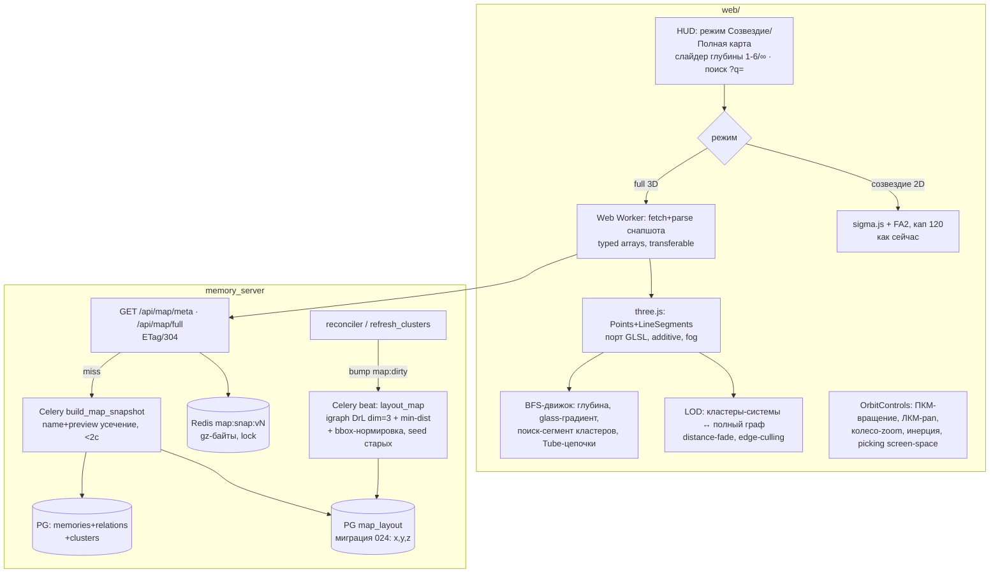

# PLAN_FULL_MAP_3D — режим «Полная карта» (3D) веб-морды selti

> **Статус:** accepted (решения Мастера по развилкам получены 2026-09-21)
> **Дата:** 2026-09-21 · **Автор:** Эна (architect) · **Утвердил:** Мастер (Серёжа)
> **Связь:** PLAN_MEMORY_REDESIGN.md (Фаза 5, веб-морда), GRAPH_LINKS_V2_ARCHITECTURE.md (reconciler), миграция 022 (кластеры Level 2)
> **Язык кода:** EN, комментарии RU (конвенции репо)

---

## 1. Цель и контекст

Отрисовать в веб-морде ВСЕ гранулы (~14.9k, растёт) и ВСЕ резолвленные рёбра (25.3k → 30k+ после кампании reconciler) в интерактивном 3D: вращение по зажатой ПКМ, регулируемая глубина связей (BFS 1-6 / ∞), поиск, подсвечивающий кластеры целиком. Без новых внешних сервисов; данные — только memories / relations / clusters; sigma.js остаётся для режима «Созвездие».

Текущее состояние (верифицировано): экран Граф (GraphScreen.tsx) — sigma.js WebGL, кастомные шейдеры StarNodeProgram / HyperspaceEdgeProgram, LOD-dim, FA2 под кап 120 узлов, `?q=` уже синкится. REST (`memory_server/api/web.py`) — весь через `_call()` → Celery (единый путь исполнения). Beat имеет часовые/ночные слоты. `relations.target_id IS NULL` (висячие имена) в карту не входят до резолва.

## 2. Решения

### 2.1 Транспорт (A) — единый снапшот `GET /api/map/full`

Один gzip-ответ на сессию (~2.2–2.6 МБ gz с preview, см. §3); кластерный уровень — клиентский LOD по уже загруженным данным, не транспорт. Инвалидация: `version = hash(count(memories), count(relations), max(updated_at), layout_rev)` — дёшево, отдаётся `GET /api/map/meta`; reconciler и refresh_clusters бампают `map:dirty` в Redis → ленивая пересборка при первом запросе. `If-None-Match` → 304. Кеш — Redis `map:snap:<version>` уже **сжатым** (gz-байты), отдача ~мс, Celery-lock против параллельных билдов.

### 2.2 Серверная раскладка 3D (B) — `igraph layout_drl(dim=3)`, нормировка на сервере

Beat/celery-таска `layout_map`: SELECT графа → DrL dim=3 (~10–60с на 15k/30k) → **фиксированный разлёт (решение Мастера 4): min-distance-релаксация (пары ближе d_min раздвигаются, неск. итераций) + нормализация масштаба в фиксированный bbox-куб [-1000, 1000]³**. Параметры в config.py (`map_layout_bbox`, `map_min_dist`). Клиентских слайдеров разлёта НЕТ. Seeding: новые узлы стартуют со старых координат — карта «дышит», не перетасовывается (критично при живом reconciler). Координаты в новой таблице **map_layout** (миграция 024: node_id, x, y, z, rev). Fallback-цепочка: полярно-сферическая раскладка кластеров (без физики, мгновенно) → `layout_fruchterman_reingold_3d` (медленный, аварийный). Пакет `fa2` отброшен (только 2D). Время таски ~1–2 мин, слот beat — ночной/часовой.

### 2.3 Глубина связей (C) — клиентский BFS по снапшоту

Все рёбра уже на клиенте: BFS от seeds по adjacency (typed arrays) — миллисекунды, слайдер **1–6 / ∞** работает без сети. Seeds: выбранный узел (клик, приоритет) или топ-результаты поиска. Узлам присваивается BFS-уровень; видимость/яркость — функция уровня (§4.2 glass). depth=∞ — фильтр снят. Накрытие полкарты на depth 5–6 — фича (радиус связности виден глазами). Клик по дальнему узлу → подсветка кратчайшего пути до seed «нитью» (TubeGeometry, светящаяся линия сквозь объём). Серверный `/api/graph/{id}?depth=N` остаётся для Созвездия без изменений.

### 2.4 Рендер (D) — raw three.js; Созвездие остаётся 2D sigma

Full-режим: `Points` + `ShaderMaterial` (порт GLSL-шейдеров Ирис почти 1:1 — глоу-звёзды, `AdditiveBlending` без depth-sort), рёбра — `LineSegments` с градиентом colorFrom/colorTo. Выбор raw three.js вместо 3d-force-graph: нам НЕ нужна встроенная физика (координаты серверные), а кастомный шейдерный конвейер — это бренд «Deep Chart». Камера: `OrbitControls` — **ПКМ-drag = вращение вокруг центра, ЛКМ = pan, колесо = zoom, enableDamping (инерция)**; click-vs-drag — порог 5px; `contextmenu preventDefault`. Кнопки «Сброс камеры / Вид сверху».

Созвездие (режим поиска, кап 120) — остаётся 2D sigma.js: плоское чтение соседей, клавиатура, принятый прод. Общий код (модель графа, BFS, API-клиент) — в общих модулях `web/src/lib/`, three-слой переиспользуем, если позже захотим 3D там.

**Picking:** screen-space, не Raycaster — на кадре движения камеры/курсора проецируем точки в экранные координаты (уже считаем gl_Position), ближайшая в радиусе ~10px с учётом экранного размера звезды; throttle через rAF-коалесценцию. Hover-подсветка соседей — частичное обновление только затронутых узлов + uniform hovered. Рёбра не пикаются.

**Перф-обязательства:** 15k Points + 30k LineSegments — единицы draw call'ов, GPU-лимит — fill-rate глоу → LOD-размер спрайтов по зуму + distance-fade (§4.4). Парсинг снапшота — в Web Worker (transferable), JSON ~7.6 МБ нетто. Мобильные (coarse pointer) — только кластерный уровень.

### 2.5 API-контракт (E)

Через существующий `_call()` → Celery (единый путь исполнения):

| Endpoint | Параметры | Ответ / коды |
|---|---|---|
| `GET /api/map/meta` | — | `200 {version, node_count, edge_count, cluster_count, layout_at, layout_stale}`; <50 мс |
| `GET /api/map/full` | `with_preview=true` (default), `project_id?`, `namespace?`; `If-None-Match` | `200` снапшот (§3) + `ETag: version`, `Cache-Control: public, max-age=60, stale-while-revalidate=600`; `304` при совпавшем ETag; `422` bad params |

Существующий `GET /api/graph/{memory_id}` — не меняется. Prometheus: `map_snapshot_build_seconds`, `map_layout_seconds`, `map_snapshot_bytes`, `map_cache_hits`.

## 3. Контракт снапшота (формат и вес)

Columnar-массивы, рёбра ссылаются индексами узлов:

```json
{
  "v": "<version-hash>",
  "ns": ["project_meta", "..."],
  "clusters": [{"i": 0, "ns": 1, "label": "...", "m": 42}],
  "nodes":  [["<uuid>", "<name>", "<preview>", nsIdx, clusterIdx|-1, size, flags, x, y, z], ...],
  "edges":  [[srcIdx, tgtIdx, typeIdx, weight], ...]
}
```

- **name** — entity_name, усечён до 80 символов (тултип).
- **preview** — контент гранулы, **усечение до ~180 символов ПО ГРАНИЦЕ СЛОВА + «…»** (решение Мастера 1; усечение на сервере в Python при сборке снапшота, не в SQL).
- Прикидка веса: узел ≈ 36 (uuid) + ~25 (name) + ~360 (180 симв. русского UTF-8) + ~40 (поля и координаты x,y,z) ≈ **~460 Б** → 15k узлов ≈ 7.0 МБ + рёбра 30k ≈ 0.5 МБ + кластеры ~0.05 МБ → **нетто ~7.6 МБ, gz ~2.2–2.6 МБ**. Приемлемо для десктопа; Redis-ключ ~2.5 МБ с EXPIRE старых версий (300с) — норма.
- Fallback для слабых машин: `with_preview=false` → нетто ~1.6 МБ / gz ~0.5 МБ (имя остаётся, тултип без превью).
- Холодная сборка: 2 SELECT + LEFT JOIN map_layout (~45k строк) ~0.5–1с + усечения + orjson ~0.3с + gzip ~0.2с → <2с, под Celery-lock.

## 4. UX-контракты

### 4.1 Поисковый сегмент = кластеры ЦЕЛИКОМ (решение Мастера 3)

Поиск на полной карте (`/api/search` по `?q=`) → для каждого hit берём cluster_id из снапшота → **подсвечиваются ВСЕ члены каждого кластера, куда попали находки; сами находки — жирнее/ярче (halo поверх)**. Находки-одиночки (вне кластеров) — просто яркие звёзды. Если находки в 6 кластерах — светятся 6 регионов: вокруг каждого региона — мягкая полупрозрачная оболочка-«туманность» (sphere, additive), читается как созвездие на карте. Прочий граф уходит в лёгкий dim (не скрывается). Сегмент живёт, пока живёт `?q=`.

### 4.2 Glass-градиент при клике (решение Мастера 2)

Клик по звезде → BFS от неё → **непрозрачность/насыщенность = непрерывная функция от BFS-расстояния**: выбранный — полный цвет, соседи — почти полные, дальние — «стеклянные» (низая альфа + дезатурация). Например `alpha = mix(0.95, 0.12, smoothstep(0, 6, dist))`; без выбора — все «твёрдые». Реализация: атрибут `bfsLevel` в шейдере + uniforms семейства, без перестройки буферов.

### 4.3 Тултип hover

DOM-тултип у курсора (максимум один): **имя гранулы + preview (~180 симв., уже в снапшоте)**. Позиция следует за курсором, скрывается на вращении камеры.

### 4.4 Distance-fade и edge-culling (требование Мастера)

Дальние от камеры звёзды прозрачнее (alpha *= fade(distance_to_camera) за порогом) — и перф (меньше fill-rate), и глубина читается. Рёбра: если оба конца за порогом дистанции или вне видимой пирамиды — не рендерятся. Вместе с fog — дальний план тает.

### 4.5 Дизайн звёзд (слот Ирис)

«Точки более красивые графические» — дизайн-слот Ирис в M3: процедурная звезда в шейдере (лучики/дифракция) или спрайт-атлас. Ограничения: additive, один draw call, LOD-размер по зуму, без текстур >256px.

### 4.6 Сквозная связка Поиск → Граф

Страница **Поиск**: действие «Показать на карте» (кнопка в карточке/списке) → переход `/ui/graph?q=<query>&view=<constellation|full>`. Экран **Граф** читает `?q=` (для Созвездия уже работает — сеет узлы результатами) и `?view=`:
- `view=constellation` (default) — текущее поведение: `?q=` сеет топ-8 через `/api/search` → `/relations`.
- `view=full` — загрузка снапшота → тот же `?q=` вызывает `/api/search` → сегмент кластеров (§4.1).
- Опционально `?depth=N` — предустановка слайдера.
URL шарабелен; `?q=` синкнется (replace, без спама истории) — уже существующий паттерн.

## 5. Схема



## 6. Фазирование

| Фаза | Что | Ответственный | Строки/тесты | Время |
|---|---|---|---|---|
| **M1 Снапшот** | `/api/map/meta`, `/api/map/full` (name+preview с усечением по слову, columnar, ETag/304, Redis gz-кеш, lock); временная сферическая раскладка кластеров | **Сона** | ~320 py + ~130 тестов | 1.5–2 д |
| **M2 Layout 3D** | dep python-igraph; миграция **024 map_layout(node_id, x, y, z, rev)**; таска `layout_map` dim=3 + **min-distance-релаксация + bbox-нормировка** (разлёт фиксированный); seed старых координат; dirty-bump; метрики | **Сона** | ~310 + ~100 тестов | 1.5–2 д |
| **M3 Full 3D UI** | three.js-слой: порт шейдеров, OrbitControls (ПКМ/ЛКМ/колесо + damping, click-vs-drag 5px), glass-материалы, кластерный LOD + fog + distance-fade + edge-culling, **поиск-сегмент кластеров с оболочками-регионами**, **тултип name+preview**, Worker-загрузка, дизайн звёзд (Ирис), `?view=full` + `?q=` + «Показать на карте» со страницы Поиск | **Ирис** | ~850–900 ts + ~70 тестов | 3–4 д |
| **M4 Глубина** | BFS-движок (typed arrays), слайдер 1-6/∞, glass-градиент от BFS-дистанции, TubeGeometry-дорожки, `?depth=` | **Ирис** | ~300 + ~40 тестов | 1.5–2 д |
| **M5 Полировка** | screen-space picking + rAF-throttle, метки CSS2DRenderer с culling (top-K по важности + порог экранного размера), мобильный кластерный-only, Prometheus-метрики, приёмка на интегрированной графике | **Ирис** (метрики — Сона) | ~250 + ~30 тестов | 1–1.5 д |

**Итого: ~2000 строк + ~370 тестов, 9–12 дней.** M2 ∥ M3 (M3 стартует на сферической раскладке M1). Каждая фаза — приёмка Катериной, независимый деплой. Первый «вау»-показ Мастеру — конец M3.

## 7. Риски и митигации

| Риск | Митигация |
|---|---|
| Fill-rate глоу на слабых GPU (аддитив, 3D-вращение) | LOD-размер спрайтов, distance-fade, приёмка Катериной на интегрированной графике; 30k LineSegments = 1 draw call — не проблема |
| Снапшот 7.6 МБ нетто / 2.6 МБ gz (из-за preview) | Worker-парсинг; `with_preview=false` для слабых машин; мониторинг `map_snapshot_bytes` |
| DrL сливает small-world компоненту в ком даже в 3D | min-distance-релаксация обязательна (не опция); веса рёбер в layout; спайк на живом корпусе в M2 до M3 |
| Дрейф карты при reconciler (+батч рёбер/час) | seed старых координат; `layout_stale` в meta → честный бейдж HUD |
| Picking/жесты: ПКМ vs контекстное меню, клик vs pan | preventDefault; порог 5px; флаг «камера двигалась» гасит клик |
| Дизориентация в объёме | умеренная инерция, «Сброс камеры / Вид сверху», fog как ориентир глубины |
| Метки в 3D = DOM-пад | жёсткий culling: видимые + top-K по важности + порог экранного размера |
| Висячие рёбра (target_id NULL) не в карте | HUD «N рёбер ждут резолва» — карта не выглядит пустее базы |
| Redis-ключи ~2.5 МБ | EXPIRE старых версий 300с; lock против параллельных билдов |

## 8. Разделение работ (директива Мастера)

**Сона (M1+M2, бэк):**
- `GET /api/map/meta`, `GET /api/map/full` (columnar, `with_preview`, ETag/304, `Cache-Control`, gzip, Redis gz-кеш, Celery-lock) через `_call()`.
- Усечение name (80) и preview (180, **по границе слова**, +«…») при сборке; `version`-hash от counts+max(updated_at)+layout_rev.
- Миграция **024**: `map_layout(node_id FK, x, y, z, rev)` + индекс; seeding прошлых координат.
- Таска `layout_map`: python-igraph `layout_drl(dim=3)` → min-distance-релаксация → bbox-нормировка [-1000,1000]³; слот beat; dirty-bump от reconciler/refresh_clusters; Prometheus `map_layout_seconds`.
- Временная сферическая раскладка кластеров (fallback M3 до готовности layout).

**Ирис (M3, three.js):**
- Порт GLSL-шейдеров звёзд/рёбер (Points+ShaderMaterial, additive; LineSegments-градиенты), дизайн звёзд (§4.5).
- OrbitControls: ПКМ-вращение / ЛКМ-pan / колесо-zoom, damping, click-vs-drag 5px, contextmenu-prevent, «Сброс/Вид сверху».
- Кластерный LOD (системы ↔ полный граф), fog, distance-fade, edge-culling.
- Glass-градиент по BFS-дистанции (атрибут bfsLevel + uniforms), поиск-сегмент кластеров целиком с оболочками-регионами, находки жирнее.
- Тултип hover: имя + preview; Worker-загрузка снапшота; `?view=full`+`?q=`+`?depth=`, кнопка «Показать на карте» со страницы Поиск.

M4 (глубина/Tube) — Ирис; M5 — Ирис + метрики Соны. Приёмка — Катерина (acc_scenarios: жесты, сегмент, глубина, 304-инвалидация, слабый GPU). Деплой — Рэй по фазам.
